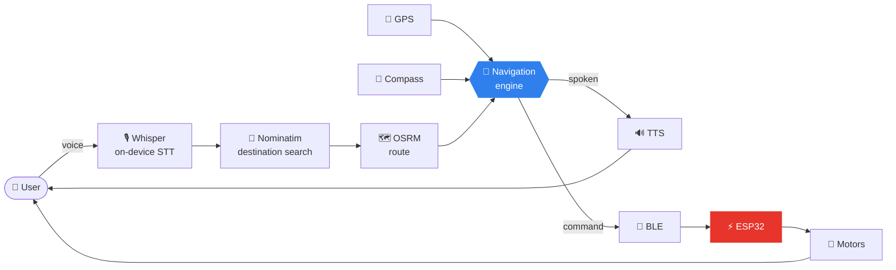
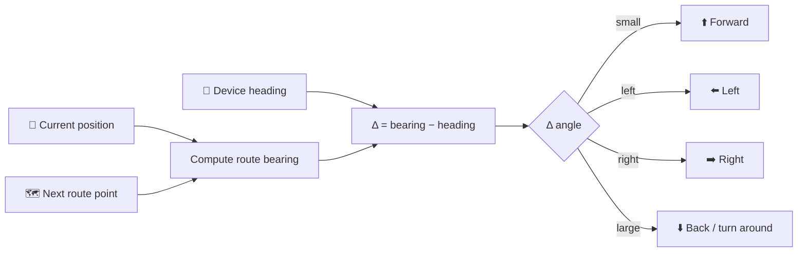
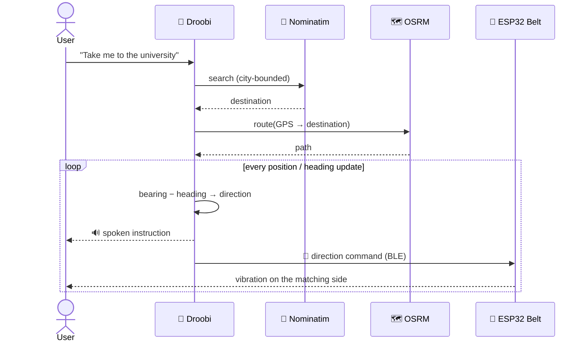
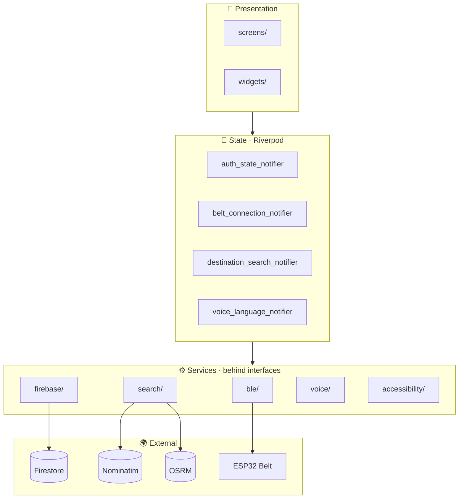
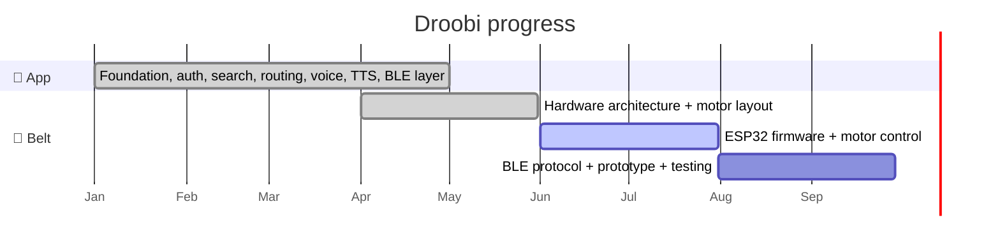

<div align="center">

# 🦯 Droobi

### *Feel the way. Don't look for it.*

**A voice + GPS + haptic navigation system for visually impaired users.**
A Flutter app that talks, listens, and drives a vibrating ESP32 belt, so the phone can stay in your pocket.

<br>


<br>

[**The Idea**](#-the-idea) •
[**Features**](#-features) •
[**How It Works**](#-how-it-works) •
[**The Belt**](#-the-belt) •
[**Quick Start**](#-quick-start) •
[**Roadmap**](#%EF%B8%8F-roadmap)

</div>

---

## 💡 The Idea

Most navigation apps assume you can look at a screen. **Droobi doesn't.**

Instead of a map, Droobi gives you three things you can actually use while walking:

| 🎙️ Talk to it | 🔊 Hear it | 📳 Feel it |
|:---:|:---:|:---:|
| Say your destination in **Arabic or English**. Speech recognition runs **on-device**. | Turn-by-turn **spoken guidance** in your language. | A **belt with vibration motors** buzzes left, right, front, or back, so you always know which way to go. |

> **Built as a graduation project** at the Arab American University (Faculty of Engineering), combining mobile development, embedded systems, BLE, and accessibility.

---

## ✨ Features

<table>
<tr>
<td width="50%" valign="top">

### 🗺️ Destination Search
- OpenStreetMap + **Nominatim**
- Palestine-focused search
- City-bounded results for accuracy
- Your selected city is **remembered**

</td>
<td width="50%" valign="top">

### 🎙️ Offline Voice Input
- **Whisper (whisper.cpp)** running locally
- No cloud speech-to-text
- Arabic + English commands
- Hands-free destination entry

</td>
</tr>
<tr>
<td width="50%" valign="top">

### 🔊 Bilingual Voice Feedback
- Text-to-Speech in **English and Arabic**
- Switch language any time from Settings

</td>
<td width="50%" valign="top">

### 🧭 Heading-Aware Guidance
- GPS position + compass heading
- Compares *where you face* with *where the route goes*
- Outputs a clear Forward / Left / Right / Back

</td>
</tr>
<tr>
<td width="50%" valign="top">

### 📡 BLE Belt Link
- Flutter ⇄ ESP32 over Bluetooth Low Energy
- Live connection status in the UI
- Interface-based service layer, swappable and testable

</td>
<td width="50%" valign="top">

### 🔐 Accounts & Roles
- Firebase Auth + Firestore profiles
- `user` / `admin` roles
- Security rules block self-promotion to admin
- Admin-only **Dev Test Menu**

</td>
</tr>
</table>

### 📍 Supported Cities

| 🏔️ West Bank | 🌊 Gaza Strip |
|---|---|
| Ramallah · East Jerusalem · Hebron · Nablus · Jenin · Bethlehem · Jericho · Tulkarm · Qalqilya · Tubas · Salfit | Gaza City · Khan Yunis · Rafah · Jabalia · Deir al-Balah |

---

## 🧠 How It Works

### The big picture



### The core trick: heading vs. bearing

The app never tells you "go north." It tells you **which way to turn from where you're facing right now**.



### One navigation session, step by step



---

## 🦯 The Belt

The belt turns directions into something you can feel. Four vibration motors sit around the waist, so **the side that buzzes is the way you go**.

```
              FRONT
          ┌─────────────┐
          │   ● motor   │
   LEFT   │             │   RIGHT
  ● motor │    ESP32    │ ● motor
          │             │
          │   ● motor   │
          └─────────────┘
              BACK
```

| Vibration | Meaning |
|:---:|---|
| ⬆️ Front | Keep going straight |
| ⬅️ Left | Turn left |
| ➡️ Right | Turn right |
| ⬇️ Back | Wrong way, turn around |

### Hardware

| Part | Role |
|---|---|
| **ESP32** | Brain + BLE radio (3.3 V logic, no boost converter needed for the MCU) |
| **ERM vibration motors** | Directional haptic output |
| **Transistor / driver stage** | Switches motors safely from GPIO |
| **LiPo battery** | Portable power |
| **TP4056** | USB charging |

### BLE command protocol (draft)

> 🚧 Not finalized. This is the working proposal while the firmware is being written.

| Byte | Command |
|:---:|---|
| `0x00` | Stop / all motors off |
| `0x01` | Forward |
| `0x02` | Left |
| `0x03` | Right |
| `0x04` | Back |

---

## 🏗️ Architecture

Clean layers: the UI never talks to hardware or the network directly.



<details>
<summary><b>📁 Folder structure</b></summary>

```text
lib/
├── core/
│   └── enums/
├── models/
│   ├── app_user.dart
│   └── destination.dart
├── screens/
│   ├── auth/
│   ├── home/
│   ├── settings/
│   └── test/
├── services/
│   ├── ble/
│   ├── firebase/
│   ├── search/
│   ├── voice/
│   └── accessibility/
├── state/
│   ├── auth_state_notifier.dart
│   ├── belt_connection_notifier.dart
│   ├── destination_search_notifier.dart
│   └── voice_language_notifier.dart
└── widgets/
    ├── connection_status_indicator.dart
    └── droobi_bottom_nav.dart
```

</details>

### ⚙️ Tech Stack

| Layer | Tech |
|---|---|
| App | Flutter · Dart |
| State | Riverpod |
| Auth & DB | Firebase Authentication · Cloud Firestore |
| Search | OpenStreetMap / Nominatim |
| Routing | OSRM |
| Location & heading | Geolocator · Flutter Compass |
| Voice in | Whisper / whisper.cpp (on-device) |
| Voice out | Flutter TTS |
| Bluetooth | Flutter Blue Plus |
| Wearable | ESP32 |

---

## 🎨 Design Principles

Built for people who can't rely on a screen, so every choice follows from that:

- 🎯 **Audio and haptics first**, visuals second
- 👆 **Large touch targets**, minimal clutter
- 🔤 **High contrast and readability** (primary color `#2F80ED`)
- 📶 **Always-visible belt connection status**
- 🌍 **Arabic and English as equals**

---

## 📱 Screenshots

> 📌 Drop your images into `assets/screenshots/`.

| Login | Home | Search | Settings | Navigation |
|:---:|:---:|:---:|:---:|:---:|
|  |  |  |  |  |

---

## 🚀 Quick Start

**You'll need:** Flutter SDK, Android Studio + Android SDK, Git, and a physical Android device (recommended for GPS, compass, and BLE).

```bash
# 1. Check your setup
flutter doctor

# 2. Clone
git clone https://github.com/Salahaldin-tech/droobi-wearable-navigation-belt.git
cd droobi-wearable-navigation-belt

# 3. Install dependencies
flutter pub get

# 4. Run (device connected or emulator started)
flutter run
```

### 🔥 Firebase setup

Enable **Authentication** and **Cloud Firestore** for your project and add the Firebase config files for your platform.

| Collection | Purpose |
|---|---|
| `users/{uid}` | User profile + role (`user` / `admin`) |
| `universityLocations/{universityId}` | Shared university location data |

### 🧪 Developer tools

Admins get a hidden testing hub for routing, BLE, and other components:

```
Settings → Developer → Dev Test Menu
```

---

## 🛣️ Roadmap



### 📱 Mobile app: ✅ core complete

- [x] Flutter foundation
- [x] Firebase Auth + Firestore profiles
- [x] Role-based admin access
- [x] Destination search + city selection (OSM / Nominatim)
- [x] GPS location + OSRM routing
- [x] Voice input (Whisper) + Text-to-Speech
- [x] BLE communication layer
- [x] Settings + Developer test menu

### 🦯 Wearable belt: 🔨 in progress

- [x] ESP32 hardware architecture
- [x] BLE communication design
- [x] Motor layout design
- [ ] ESP32 firmware
- [ ] Motor control
- [ ] Complete BLE command protocol
- [ ] Physical belt prototype
- [ ] Hardware integration testing
- [ ] Navigation accuracy testing

### 🔭 What's next

- Better GPS filtering and heading estimation
- Smarter route-following logic
- More robust BLE reconnection
- Richer vibration patterns
- Battery optimization
- Better Arabic voice interaction
- **Testing with visually impaired users** and safety improvements

---

## 🤝 Contributing

Ideas, bug reports, and PRs are welcome.

```bash
git checkout -b feature/your-feature
git commit -m "Add your feature"
git push origin feature/your-feature
```

Then open a Pull Request.

---

## 📜 License

Developed as an academic / graduation project. If you want to reuse, distribute, or commercially deploy it, please contact the authors first.

---

<div align="center">

### 🦯 Droobi

**Technology that helps you find your way, without needing to see it.**

Built with Flutter • Firebase • OpenStreetMap • ESP32 • BLE

</div>
